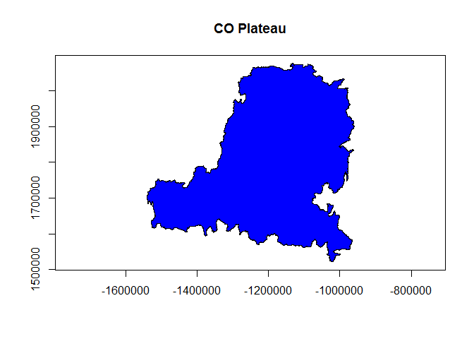
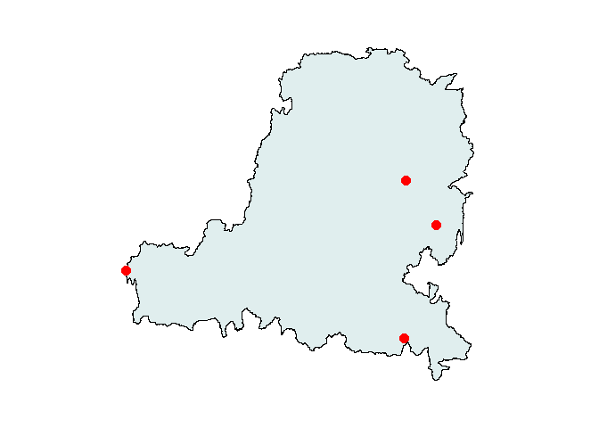
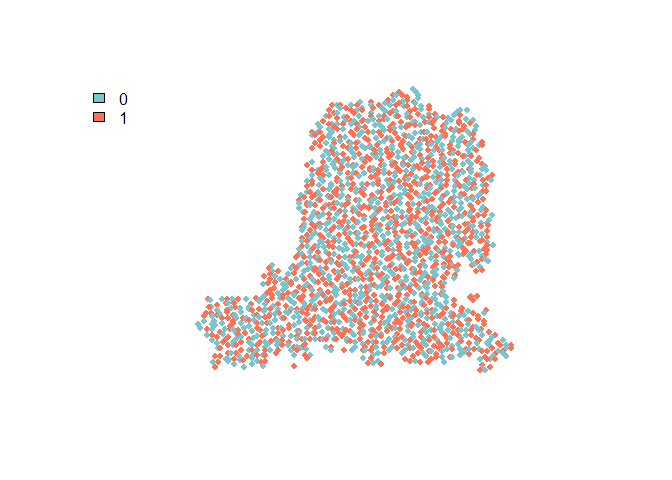

# Module 1.1: Importing and Exporting Vector GIS Data in R
IALE 2015 R GIS Student Workshop  
July 07, 2015  

Module 1.1 code by Jillian Deines, Michigan State University


## R Packages Needed
__Workhorse packages:__ You can do a whole heck of a lot with a few basic packages:


```r
library(sp)         # a dependency for most spatial packages (also loaded with rgdal)
library(rgdal)      # R bindings for the Geospatial Data Abstraction Library    
library(maptools)   # for the 'readShapeSpatial' example
```

## Set Your Working Directory
Here, we'll use the `setwd` function to tell R where the module 1 folder is located on our machine. This will depend on the location of your downloaded course folder, Intro-Spatial-R.


```r
# modify the filepath based on your user specific folder location
# Single or double quotes work for text strings. Must use forward slashes.

#Some common examples:
#setwd('C:/Users/username/Documents/Intro-Spatial-R/module1')   # for Windows users
#setwd("~/Documents/Intro-Spatial-R/module1")                   # ~ for Mac users
setwd('D:/RWorkshop/Intro-Spatial-R/module1')                   # Jill's computer  
```


## Read in Shapefiles
Two primary functions exist to read in .shp files:

* `readShapeSpatial` in package 'maptools' doesn't read projection information; need to set manually
* `readOGR` in package 'rgdal' reads projection information, so **we'll use this exclusively**. More information on manipulating projections in R will follow in Module 2.

### Import Polygon Shapefile
Here, we import a polygon boundary for the Colorado Plateau (CP) that has an Albers Equal Area projection, "COP_boundpoly_aea.shp" from the 'module1/data' course subfolder. 


```r
# load shapefile by specifying folder name (dsn), and layer name (no extension!)
cp.poly <- readOGR(dsn = 'data',             # subfolder name 
                   layer = 'COP_boundpoly_aea')   # file name without extension
```

```
## OGR data source with driver: ESRI Shapefile 
## Source: "data", layer: "COP_boundpoly_aea"
## with 1 features
## It has 1 fields
```

#### Examples for Alternative Directory Structures
Many people do not use `setwd` to set working directories, or you may have your directory structured differently on future projects. Here are a few examples for alternative directory structures. The examples are specific to my directory structure, so these examples are not run.

**1. Not using a working directory**  
This is essentially what `setwd` does under the hood - appends the working directory filepath to your directory call:


```r
cp.poly <- readOGR(dsn = 'D:/RWorkshop/Intro-Spatial-R/module1/data',
                   layer = 'COP_boundpoly_aea')
```

**2. Shapefile located in your base working directory**  
If you are reading in a shapefile that is located in your working directory, you need to use `dsn = '.'` to refer to the current working directory:


```r
setwd('D:/RWorkshop/Intro-Spatial-R/module1/data') 
cp.poly <- readOGR(dsn = '.', layer = 'COP_boundpoly_aea')
```

#### Examine loaded shapefile
Let's take a look at what we loaded.


```r
# View description. Note the coordinate bounding box and projection info
summary(cp.poly)
```

```
## Object of class SpatialPolygonsDataFrame
## Coordinates:
##        min       max
## x -1540636 -959647.5
## y  1521625 2076338.7
## Is projected: TRUE 
## proj4string :
## [+proj=aea +lat_1=29.5 +lat_2=45.5 +lat_0=23 +lon_0=-96 +x_0=0
## +y_0=0 +datum=NAD83 +units=m +no_defs +ellps=GRS80 +towgs84=0,0,0]
## Data attributes:
##        Id   
##  Min.   :0  
##  1st Qu.:0  
##  Median :0  
##  Mean   :0  
##  3rd Qu.:0  
##  Max.   :0
```

```r
# just look at projection
proj4string(cp.poly)
```

```
## [1] "+proj=aea +lat_1=29.5 +lat_2=45.5 +lat_0=23 +lon_0=-96 +x_0=0 +y_0=0 +datum=NAD83 +units=m +no_defs +ellps=GRS80 +towgs84=0,0,0"
```

```r
# make a simple plot
plot(cp.poly, axes=T, col='blue', main = "CO Plateau")
```

 

#### Alternative demonstration: readShapeSpatial in package Maptools

If you search for help online, you may find another common way to load shapefiles: the `readShapeSpatial` function in the package maptools. This is a valid alternative, but it's important to note that this function does not automatically load projection information:


```r
# load shapefile by specifying file name with extension
cp.poly2 <- readShapeSpatial('data/COP_boundpoly_aea.shp') 

## NOT RUN: equivalent alternative example if not setting a working directory,
## based on my computer's directory structure:
#cp.poly2 <- readShapeSpatial('D:/RWorkshop/Intro-Spatial-R/module1/data/COP_boundpoly_aea.shp')

# look at the projection information: none
summary(cp.poly2)
```

```
## Object of class SpatialPolygonsDataFrame
## Coordinates:
##        min       max
## x -1540636 -959647.5
## y  1521625 2076338.7
## Is projected: NA 
## proj4string : [NA]
## Data attributes:
##        Id   
##  Min.   :0  
##  1st Qu.:0  
##  Median :0  
##  Mean   :0  
##  3rd Qu.:0  
##  Max.   :0
```

Instead, you need to know your projection and define it manually. This does not involve re-projecting your GIS layer, or changing the projection. You are only telling R what projection your file is in. R uses PROJ.4 projection definitions, which you can find by searching at the website http://spatialreference.org. More on this in module 2. Here we'll assume I know the proj4 information. **Note that proj4strings are sensitive to spacing and can have no hard returns/line breaks**.


```r
# define the AEA projection information
aea.proj <- "+proj=aea +lat_1=29.5 +lat_2=45.5 +lat_0=23 +lon_0=-96 +x_0=0 +y_0=0 +datum=NAD83 +units=m +no_defs +ellps=GRS80 +towgs84=0,0,0"
# set projection of object
proj4string(cp.poly2) <- CRS(aea.proj)
# look at projection info
summary(cp.poly2)
```

```
## Object of class SpatialPolygonsDataFrame
## Coordinates:
##        min       max
## x -1540636 -959647.5
## y  1521625 2076338.7
## Is projected: TRUE 
## proj4string :
## [+proj=aea +lat_1=29.5 +lat_2=45.5 +lat_0=23 +lon_0=-96 +x_0=0
## +y_0=0 +datum=NAD83 +units=m +no_defs +ellps=GRS80 +towgs84=0,0,0]
## Data attributes:
##        Id   
##  Min.   :0  
##  1st Qu.:0  
##  Median :0  
##  Mean   :0  
##  3rd Qu.:0  
##  Max.   :0
```

I prefer the single step of `readOGR`, but this is helpful to know if the shapefile itself doesn't have a defined projection and you need to define it manually.

### Import Line and Point Shapefiles
All shapefiles are read in the same with the `readOGR` function (as well as `readShapeSpatial`). Here we'll load points from the "COP_Major_Cities_pt.shp" as a demonstration. Note that this shapefile has an attribute table with 47 columns/attributes.


```r
# load shapefile by specifying folder name (dsn), and layer name (no extension!)
cities <- readOGR(dsn = 'data', layer = 'COP_Major_Cities_pt')
```

```
## OGR data source with driver: ESRI Shapefile 
## Source: "data", layer: "COP_Major_Cities_pt"
## with 4 features
## It has 47 fields
```

```r
# make a quick plot. note that projections need to match
par(mar=c(2,2,2,2))             # make plot margins smaller
plot(cp.poly, col='azure2')     # plot CO Plateau polygon
plot(cities, add=T,             # add city points using add=T
     col='red',                 # point color      
     pch=19,                    # point type (here, solid circles)
     cex=1.5)                   # point size
```

 

## Convert Latitude/Longitude Spreadsheet Data to A Point Shapefile
If you have a spreadsheet of latitude and longitude data points, you can convert that to a spatialPointsDataFrame (spdf) in R and then write out a shapefile for future use. Here we'll use coordinate data that is in .csv format, but you could also use .xls(x) provided you use the appropriate R package to load Excel files (I'd recommend `readxl`). Generally, .csv or .txt files are faster and easier to use.

Here, we'll load lat/long presence/absence data for the species Juniperus osteosperma in the juos_presab.csv spreadsheet and learn how to write out shapefiles.


```r
juos <- read.csv('data/juos_presab.csv')
# look at data structure: 
str(juos)
```

```
## 'data.frame':	1798 obs. of  3 variables:
##  $ juos   : int  0 0 0 1 1 1 0 1 1 0 ...
##  $ wgs84_x: num  -109 -109 -109 -109 -109 ...
##  $ wgs84_y: num  41 41 41 40.9 40.9 ...
```

```r
head(juos)
```

```
##   juos   wgs84_x  wgs84_y
## 1    0 -109.0390 40.99637
## 2    0 -109.3372 40.95580
## 3    0 -108.9809 40.95033
## 4    1 -109.4567 40.91271
## 5    1 -109.3977 40.91184
## 6    1 -109.2789 40.91011
```

```r
# convert dataframe to spdf by specifying long and lat column names
# format: ~ longitudeColumn + latitudeColumn
coordinates(juos) <- ~ wgs84_x + wgs84_y
# check out our new spdf object
summary(juos)
```

```
## Object of class SpatialPointsDataFrame
## Coordinates:
##                min        max
## wgs84_x -113.58918 -106.96000
## wgs84_y   36.34323   40.99637
## Is projected: NA 
## proj4string : [NA]
## Number of points: 1798
## Data attributes:
##       juos       
##  Min.   :0.0000  
##  1st Qu.:0.0000  
##  Median :0.0000  
##  Mean   :0.4889  
##  3rd Qu.:1.0000  
##  Max.   :1.0000
```

Note once again that our projection is undefined. Since the .csv has no associated projection information, we need to specify it. We know that the coordinates are in a WGS84 based lat/long coordinate reference system. Again you can use http://spatialreference.org to find proj4 strings (more detail in Module 2)


```r
# create character vector defining the proj4 string for WGS84
WGS84.proj <- "+proj=longlat +datum=WGS84" 
# set the proj4string
proj4string(juos) <- CRS(WGS84.proj)  
# take a look
summary(juos)
```

```
## Object of class SpatialPointsDataFrame
## Coordinates:
##                min        max
## wgs84_x -113.58918 -106.96000
## wgs84_y   36.34323   40.99637
## Is projected: FALSE 
## proj4string :
## [+proj=longlat +datum=WGS84 +ellps=WGS84 +towgs84=0,0,0]
## Number of points: 1798
## Data attributes:
##       juos       
##  Min.   :0.0000  
##  1st Qu.:0.0000  
##  Median :0.0000  
##  Mean   :0.4889  
##  3rd Qu.:1.0000  
##  Max.   :1.0000
```

Note that 'Is projected:" is FALSE because we are using latitude/longitude coordinates, not a projected reference system based on meters, etc.

Plot our new spatial points, coloring based on presence/absence attribute.


```r
# make a plot based on juos attribute column (0 or 1)
plot(juos, pch=19, cex = 0.8, col=c("cadetblue3","coral1"))
# add a simple legend
legend("topleft",                          # position in plot
       fill=c("cadetblue3","coral1"),      # match colors with plot colors   
       legend = c("0","1"),                # specify legend text
       bty='n')                            # don't use a box around the legend
```

 

## Write Out Shapefile
All shapefiles (points, lines, and polygons) can be written out with the `writeOGR` function in the rgdal package. Here we demonstrate with our newly created spatial point object, which we will write out to the "outData" subfolder within the module 1 data directory and call "juos_pts_wgs84.shp".

Note that we will use the ESRI shapefile driver to create a .shp file, but the 'driver' argument has many options including GeoJSON, KML, etc. Typing ogrDrivers() at your command line will give a list of available drivers.


```r
# write out point shapefile. 
writeOGR(obj = juos, dsn = 'data/outData', layer = 'juos_pts_wgs84',
         driver = 'ESRI Shapefile', overwrite_layer=T)
```

There should now be a file "juos_pts_wgs84.shp" in your ...Intro-Spatial-R\module1\data\outdata folder. 

End Module 1.1.


